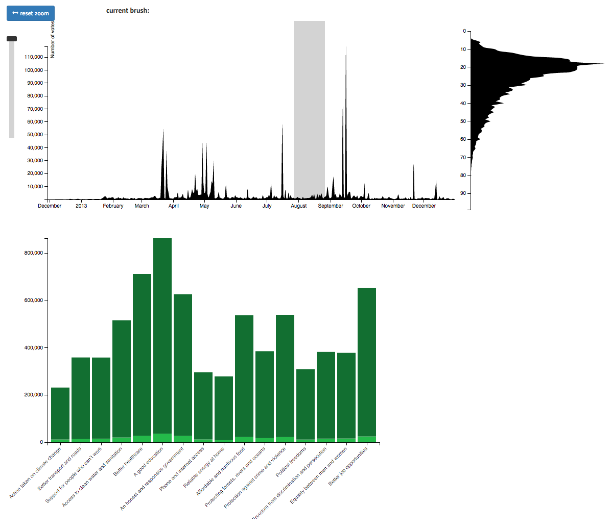
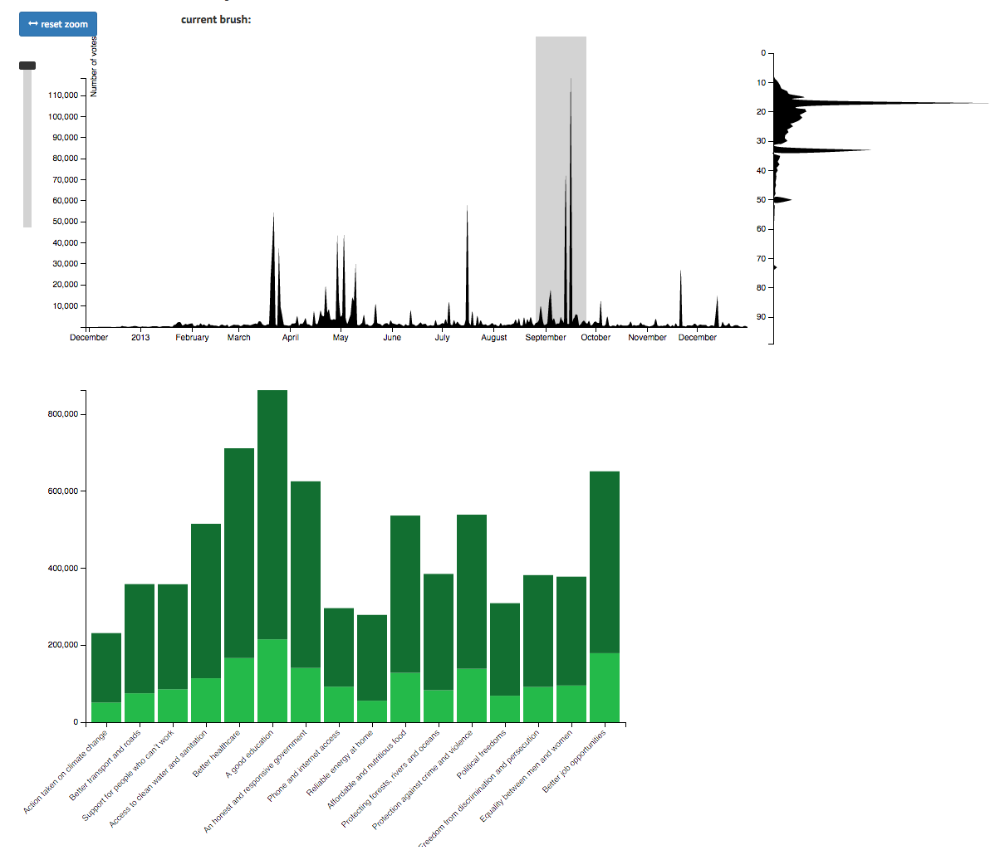

# Answers for Questions

### Q5a
**Question:** Choose __one__ comparison scenario and create at least three alternative designs that would allow this comparison.

-
**Answer:**

- put your sketches in folder [designStudio/](designStudio/)

- add any additional comments here

### Q5b
**Question:** Implement one design in your visualization for **PrioVis** and explain why you have chosen this design.

-
**Answer:**

- The design I chose does a great job of showing how much of the total votes for each category were made in the brush selection. When there is no selection or the whole thing is selected you see a green bar graph that shows the total number of votes for each category, but when you make selection with the brush you see two bars stacked on top of each other. The total height is the same as the height of the total votes, but the bottom light green bar shows how many of the votes are from the current the selection and the top dark green bar shows how many are from the inverse of the selection. This allows the users to easily see which time intervals accounted for the most or the least number of votes to each category.

### Q5c
**Question:** As a very minimal case study submit a screenshot of an interesting pattern which you have found with your method and briefly describe the pattern.

-
**Answer:**

- One pattern I found with my implementation was a large increase in votes for better education at the beginning of the school year. When the month of August is selected you can see that a very small percentage of the total votes for better education were made, but when you select the month of September you see that a very large percentage of the total education votes were made. This was not as noticeable in the original design, but my design makes it easy to see this pattern.

